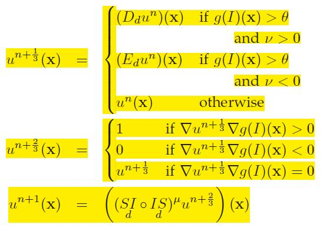
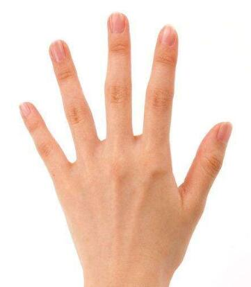
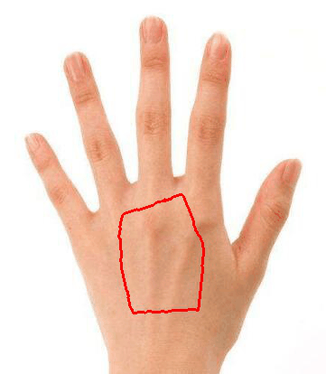

C++版本：https://github.com/zhongqianli/morph_snakes
《A Morphological Approach to Curvature-Based Evolution of Curves and Surfaces》巧妙地将将求解偏微分方程问题近似转换为形态学算子问题，高效，稳定。

用途：医学图像分割、手掌图像分割等，只要是图像分割问题，都可以试试，而且速度比GAC快很多。

# MorphGAC算法的核心部分：

# MorphGAC实验结果
## 输入图像：  

## 初始状态：  

## 动态结果（可以通过MorphGAC的balloon参数控制曲线是膨胀还是收缩）：  

